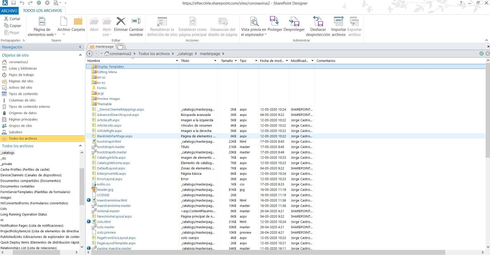

# sharepoint-template
Template HTML para SharePoint 365

Ejercicio de de clase en la creacion de una pagina maestra para SharePoint 365   

Es solo un ejemplo y es necesario configurar los estilos de Bootstrap para hacerlo coexistir con SharePoint.  

Para ello es necesario:

* Instalar la caracteristica de Publicacion a nivel de Coleccion de Sitio.

* Usando SharePoint Designer, subir el html, css e imagen.

* Con la caracteristica de diseño, convertir el html en una pagina maestra.

## Mas información

https://docs.microsoft.com/en-us/sharepoint/dev/general-development/how-to-convert-an-html-file-into-a-master-page-in-sharepoint

